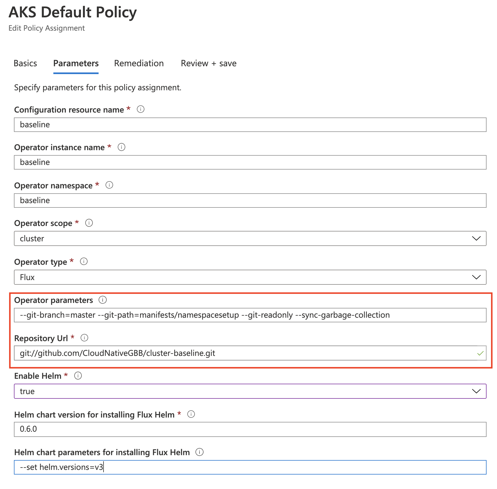
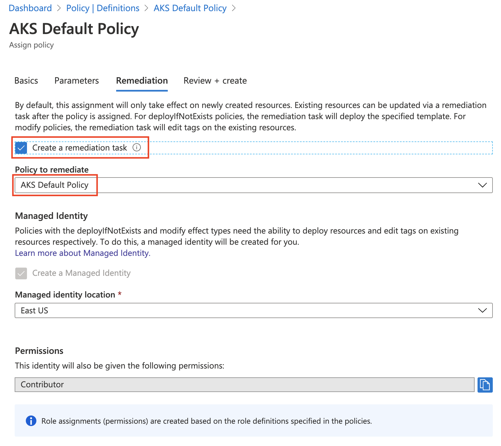

# Apply Azure Policy to AKS Cluster

When setting up Azure Arc for Kubernetes, you will typically want multiple configurations applied. Instead of applying these configurations manually each time, or as part of an automated pipeline, wouldn't it be nice to have it done for you automatically when the AKS Cluster is created.

## Create Azure Policy Definition for use with Git Source Control

The following steps will create the **Azure Policy Definition** used to point to a git source control repo for use with GitOps.

1. In the Azure portal, navigate to Policy, and in the Authoring section of the sidebar, select Definitions.
2. Select + Policy definition.
3. Set the Definition location to your subscription or management group. This will determine the broadest scope where the policy definition can be used.
4. Give the policy a Name and Description.
5. Under category, choose Create new, and write **Kubernetes Cluster - Azure Arc**
6. In the Policy rule edit box, copy/paste the contents of this [policydefinition-gitopsforaks](../azurepolicy/policydefinition-gitopsforaks.json) policy definition.


7. Save.

## Assign Azure Policy Definition to Azure Subscription Scope

The following steps assign the **Azure Policy Definition** created above to an assigned scope. In our case we are going to assign it to an Azure Subscription so that any AKS cluster that is created in that Azure Subscription will automatically get the policy definition above assigned to it.

1. In the Azure portal, navigate to Policy, and in the Authoring section of the sidebar, select Definitions.
2. Find the definition you just created, and select it.
3. In the page actions, select Assign.
4. Set the Scope to the management group, subscription, or resource group where the policy assignment will apply.
5. If you want to exclude any resources from the policy scope, then set Exclusions.
6. Give the policy assignment a Name and Description that you can use to identify it easily.
7. Ensure that Policy enforcement is set to Enabled.


8. Click Next.
9. Set parameter values that will be used during creation of the sourceControlConfiguration.



10. Click Next.
11. Enable Create a remediation task.
12. Assure that Create a managed identity is checked, and that the identity will have Contributor permissions.



13. Review + create

## Validate Assignment

1. Check that Azure Policy Assignment Exists


2. Check to see if the Azure Policy has been Applied (via Azure Policy & Azure Kubernetes Service Views)


Note:
*****************************************************************************************
Wait until Azure Policy has been applied and the resource is compliant before proceeding. It should take upwards of 5 mins or so, 30 mins worst case scenario.
*****************************************************************************************

3. Validate that the namespaces, limit ranges and quotas were created

```bash
# Check that flighttracker-dev, flighttracker-staging, and flighttracker-production exist
kubectl get ns flighttracker-dev
kubectl get ns flighttracker-staging
kubectl get ns flighttracker-production

# Check that LimitRanges exist for each Namespace
kubectl get limitranges -A

# Check that ResourceQuotas exist for each namespace
kubectl get resourcequotas -A
```
